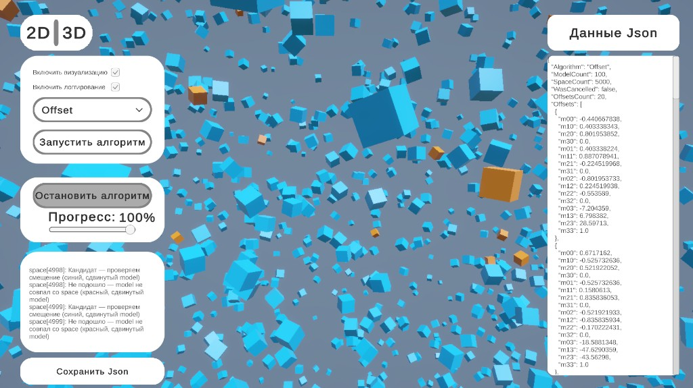

# ceramic-model-space-matcher

Unity-проект: ищем все смещения массива матриц модели в заданном пространстве и показываем процесс поиска на сцене.

Unity 6, URP, VContainer, Newtonsoft.Json, TextMesh Pro.

**Попробовать онлайн:** [CeramicTest3d на itch.io](https://alecsss100.itch.io/ceramictest3d) — WebGL-билд, можно запустить в браузере без установки Unity.

## Как выглядит

Слева — панель управления (алгоритм, запуск, прогресс, лог), справа — JSON с результатом, на сцене — кубы model/space и подсветка шагов поиска.

<p align="center">
  
</p>

---

## Задача

Есть два JSON-файла с 4×4 матрицами — **model** (100 шт.) и **space** (5000 шт.).

Нужно найти все матрицы-смещения `offset`, при которых сдвинутая модель целиком лежит в `space`:

```
offset * model[i] ∈ space   для всех i
```

Матрицы сравниваются с допуском `epsilon = 1e-4`. Плюс — визуализация того, как идёт поиск, и возможность сохранить результат.

---

## Что делал

Сначала поднял базовый Unity-проект, загрузку JSON и отображение матриц кубами на сцене.

Потом написал алгоритм поиска и сделал пошаговый режим — чтобы можно было смотреть, как перебираются кандидаты. Визуализацию и паузы между шагами вынес в декораторы, чтобы не трогать сам алгоритм.

Дальше добавил UI: выбор алгоритма, запуск, прогресс, лог, переключение 2D/3D, остановку и сохранение результата в JSON. Сборку зависимостей перевёл на VContainer.

---

## Алгоритмы

Оба работают по одной схеме: для каждой точки из `space` строится кандидат `offset = space[j] * inverse(model[0])`, потом проверяется, что все `offset * model[i]` есть в `space`.

**Matrix Brute Force** — простой перебор. На каждую проверку заново ищем матрицу в `space` линейным проходом. Понятно и достаточно для небольших данных, но на 5000 точек уже тормозит.

**Offset** — основной вариант. Перед поиском строит индекс по `space`, чтобы не гонять полный перебор каждый раз. На тестовых данных работает заметно быстрее brute force.

Обозначения: **M** — размер model, **S** — размер space.

| Алгоритм | Скорость | Память |
|---|---|---|
| **Matrix Brute Force** | O(S² × M) — для каждой из S точек space проверяем M матриц model, каждая проверка = полный проход по space | — |
| **Offset** | O(S × M) в среднем — один раз строим индекс по space, дальше поиск матрицы за O(1) | O(S) — индекс по space + список найденных offset'ов |

---

## Функционал

**2D / 3D** — переключение вида: кубы либо на плоскости перед камерой, либо в полноценном 3D.

**Run + Visualize** — запуск поиска с пошаговой отрисовкой на сцене. Прогресс-бар показывает, сколько `space` уже обработано.

**Logging** — шаги алгоритма в панели лога.

**Stop** — остановить текущий прогон. То, что успело найтись, можно сохранить.

**Save JSON** — после завершения показывает результат в UI и сохраняет в файл.

### Цвета на сцене

| Цвет | Значение |
|---|---|
| Синий | Проверяем кандидат, показан сдвинутый model |
| Красный | Не подошло |
| Зелёный | Смещение найдено |
| Чёрный | Дубликат offset, маркер на точке space |

---

## WebGL-билд

Интерактивную версию можно запустить в браузере: **[alecsss100.itch.io/ceramictest3d](https://alecsss100.itch.io/ceramictest3d)**
